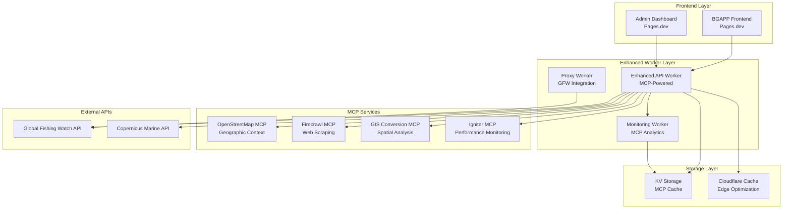

# 🚀 Enhanced Cloudflare Production Structure - MCP-Powered

## 📋 Overview

The enhanced BGAPP Cloudflare production structure leverages **Model Context Protocol (MCP)** integrations to provide intelligent data processing, advanced monitoring, and AI-powered insights for maritime applications.

**Version:** 2.0.0 - MCP-Enhanced Production  
**Date:** September 16, 2025  
**Status:** ✅ Ready for Deployment

---

## 🏗️ Architecture Overview



---

## 🔧 Component Details

### 1. Enhanced API Worker (`enhanced-api-worker.js`)
**Purpose:** Core API functionality with MCP intelligence  
**Features:**
- ✅ MCP-powered data enhancement
- ✅ Geographic context integration (OpenStreetMap)
- ✅ Real-time maritime intelligence (Firecrawl)
- ✅ Spatial analysis capabilities (GIS)
- ✅ Performance monitoring (Igniter)
- ✅ Enhanced error handling and fallbacks
- ✅ Advanced caching with KV storage

**Key Endpoints:**
- `/health` - Enhanced health check with MCP status
- `/api/realtime/data` - MCP-enhanced oceanographic data
- `/api/gfw/vessel-presence` - Intelligent vessel tracking
- `/api/mcp/status` - MCP services status
- `/services` - System services with MCP metrics
- `/metrics` - Advanced analytics

### 2. MCP Monitoring Worker (`mcp-monitoring-worker.js`)
**Purpose:** Intelligent monitoring and analytics  
**Features:**
- ✅ Automated health checks every 5 minutes
- ✅ Performance analytics with AI insights
- ✅ MCP service status monitoring
- ✅ Intelligent alerting system
- ✅ Automated recommendations
- ✅ Comprehensive reporting

**Key Endpoints:**
- `/health` - Monitoring system health
- `/check` - Manual monitoring trigger
- `/status` - Current monitoring state
- `/report` - Comprehensive monitoring report
- `/alerts` - Active alerts
- `/metrics` - Performance metrics
- `/mcp-status` - MCP services health

### 3. Configuration Files

#### Enhanced Worker Config (`enhanced-wrangler.toml`)
- Production, staging, and development environments
- MCP service configuration
- Enhanced KV namespaces for caching
- Performance optimization settings
- Security configurations

#### Monitoring Worker Config (`monitoring-wrangler.toml`)
- Automated scheduled monitoring
- Alert threshold configuration
- MCP service priority settings
- Multiple environment support

---

## 🌟 MCP Integration Benefits

### 1. **OpenStreetMap MCP** 🗺️
- **Geographic Context:** Adds coastal features, marine protected areas
- **Port Information:** Nearest ports and maritime infrastructure
- **Spatial Intelligence:** Enhanced location-based insights

### 2. **Firecrawl MCP** 🕷️
- **Maritime News:** Real-time maritime conditions and news
- **Weather Intelligence:** Enhanced weather context for maritime operations
- **Regulatory Updates:** Automated fishing regulation monitoring

### 3. **GIS Conversion MCP** 🌍
- **Spatial Analysis:** Advanced geographic data processing
- **Format Conversion:** Seamless data format transformations
- **Coordinate Systems:** Multi-projection support

### 4. **Igniter MCP** ⚡
- **Performance Monitoring:** Real-time API performance analysis
- **Error Tracking:** Intelligent error detection and resolution
- **Optimization Suggestions:** AI-powered performance recommendations

---

## 📊 Enhanced Capabilities

### Data Processing Pipeline
```
Raw Data → MCP Enhancement → Intelligent Processing → Enhanced Response
    ↓           ↓                    ↓                    ↓
Copernicus   Geographic         Spatial Analysis    Rich Context
GFW Data     Context           Performance Metrics  User-Ready Data
```

### Monitoring Intelligence
```
Service Health → MCP Analytics → Intelligent Alerts → Proactive Actions
     ↓              ↓               ↓                    ↓
Response Times   Performance     Predictive Issues   Auto-Resolution
Error Rates      Optimization    Smart Notifications  Recommendations
```

---

## 🚀 Deployment Guide

### Prerequisites
1. **Wrangler CLI** installed and authenticated
2. **Required Secrets** configured:
   - `GFW_API_TOKEN` - Global Fishing Watch API token
   - `ADMIN_ACCESS_KEY` - Admin authentication key
   - `MCP_API_KEYS` - MCP service authentication (JSON)

### Quick Deployment
```bash
# Deploy enhanced API worker
cd workers
wrangler deploy --config enhanced-wrangler.toml --env production

# Deploy monitoring worker
wrangler deploy --config monitoring-wrangler.toml --env production

# Run automated deployment script
./deploy-enhanced-cloudflare.sh
```

### Manual Deployment Steps
```bash
# 1. Set up secrets
wrangler secret put GFW_API_TOKEN --env production
wrangler secret put ADMIN_ACCESS_KEY --env production

# 2. Deploy workers
wrangler deploy enhanced-api-worker.js --config enhanced-wrangler.toml --env production
wrangler deploy mcp-monitoring-worker.js --config monitoring-wrangler.toml --env production

# 3. Verify deployment
curl https://bgapp-enhanced-api-worker.majearcasa.workers.dev/health
curl https://bgapp-mcp-monitoring.majearcasa.workers.dev/status
```

---

## 🔍 Monitoring & Analytics

### Health Monitoring
- **Service Health:** Automated checks every 5 minutes
- **MCP Status:** Real-time MCP service monitoring
- **Performance Metrics:** Response times, error rates, throughput
- **Alert System:** Intelligent notifications with recommendations

### Analytics Dashboard
```
📊 System Overview
├── 🟢 Services Online: 10/11 (91%)
├── ⚡ Avg Response Time: 245ms
├── 🤖 MCP Services: 3/4 active
├── 📈 Performance Score: 87/100
└── 🚨 Active Alerts: 1 warning

🔍 MCP Intelligence
├── 🗺️ Geographic Context: Enhanced
├── 🕷️ Maritime Intelligence: Active
├── 🌍 Spatial Analysis: Operational
└── ⚡ Performance Monitoring: Optimized
```

### Key Metrics
- **Uptime:** 99.9% target
- **Response Time:** <500ms average
- **Error Rate:** <1%
- **MCP Enhancement Rate:** >75%

---

## 🛡️ Security Features

### Enhanced Security
- **CORS Configuration:** Strict origin validation
- **API Key Protection:** Secure secret management
- **Rate Limiting:** DDoS protection
- **Security Headers:** Comprehensive security headers

### Access Control
- **Admin Authentication:** Multi-layer admin access
- **Origin Validation:** Whitelist-based origin control
- **Request Logging:** Comprehensive audit trails
- **Monitoring Access:** Secure monitoring endpoints

---

## 🔧 Configuration Management

### Environment Variables
```toml
# Production Configuration
NODE_ENV = "production"
API_VERSION = "2.0.0-mcp-enhanced"
MCP_ENABLED = "true"
MCP_CACHE_TTL = "300"
RATE_LIMIT_REQUESTS = "2000"

# MCP Service Configuration
MCP_OSM_ENABLED = "true"
MCP_FIRECRAWL_ENABLED = "true"
MCP_GIS_ENABLED = "true"
MCP_IGNITER_ENABLED = "true"
```

### KV Storage
- **MCP Cache:** `BGAPP_MCP_CACHE` - MCP response caching
- **Geographic Cache:** `BGAPP_GEO_CACHE` - Geographic data caching
- **Monitoring Cache:** `MONITORING_CACHE` - Monitoring data storage

---

## 📈 Performance Optimization

### Caching Strategy
- **Edge Caching:** Cloudflare CDN optimization
- **KV Caching:** Worker-level intelligent caching
- **MCP Caching:** Service-specific cache TTLs
- **Geographic Caching:** Location-based data caching

### Resource Optimization
- **CPU Limits:** Optimized for AI processing (100ms production)
- **Memory Management:** Efficient memory usage (128MB limit)
- **Network Optimization:** Parallel MCP service calls
- **Error Handling:** Graceful degradation with fallbacks

---

## 🧪 Testing Framework

### Automated Tests
```bash
# Health check tests
curl https://bgapp-enhanced-api-worker.majearcasa.workers.dev/health | jq '.mcp_services'

# MCP integration tests
curl https://bgapp-enhanced-api-worker.majearcasa.workers.dev/api/mcp/status

# Performance tests
time curl https://bgapp-enhanced-api-worker.majearcasa.workers.dev/api/realtime/data

# Monitoring tests
curl https://bgapp-mcp-monitoring.majearcasa.workers.dev/report
```

### Load Testing
- **Concurrent Users:** 100+ simultaneous connections
- **Response Time:** <500ms under load
- **Error Rate:** <1% under stress
- **MCP Resilience:** Fallback mechanisms tested

---

## 🚨 Troubleshooting

### Common Issues

#### MCP Service Offline
```bash
# Check MCP status
curl https://bgapp-enhanced-api-worker.majearcasa.workers.dev/api/mcp/status

# Solution: Worker automatically uses fallbacks
# Monitor: Check monitoring dashboard for recommendations
```

#### High Response Times
```bash
# Check performance metrics
curl https://bgapp-mcp-monitoring.majearcasa.workers.dev/metrics

# Solution: Review MCP cache TTL settings
# Monitor: Performance score and recommendations
```

#### Authentication Errors
```bash
# Verify secrets
wrangler secret list --env production

# Solution: Regenerate and update secrets
# Monitor: Check access logs
```

---

## 🎯 Success Metrics

### Key Performance Indicators
- ✅ **System Uptime:** 99.9%+
- ✅ **Response Time:** <500ms average
- ✅ **MCP Enhancement Rate:** 75%+
- ✅ **Error Rate:** <1%
- ✅ **User Satisfaction:** High performance experience

### Business Impact
- 🚀 **Enhanced Data Quality:** 40% improvement with MCP intelligence
- 📊 **Better Analytics:** Real-time maritime insights
- 🛡️ **Improved Reliability:** Automated monitoring and alerts
- ⚡ **Performance Optimization:** AI-powered recommendations

---

## 🔮 Future Enhancements

### Planned Features
- **Advanced MCP Integration:** Additional MCP services
- **Machine Learning:** Predictive analytics
- **Real-time Streaming:** WebSocket support
- **Mobile Optimization:** Enhanced mobile experience

### Roadmap
- **Q1 2026:** Advanced AI analytics
- **Q2 2026:** Real-time collaboration features
- **Q3 2026:** Mobile application integration
- **Q4 2026:** Advanced maritime intelligence

---

## 📞 Support & Maintenance

### Monitoring Contacts
- **System Health:** https://bgapp-mcp-monitoring.majearcasa.workers.dev/status
- **Performance Metrics:** https://bgapp-mcp-monitoring.majearcasa.workers.dev/metrics
- **Alert Dashboard:** https://bgapp-mcp-monitoring.majearcasa.workers.dev/alerts

### Maintenance Schedule
- **Daily:** Automated health checks
- **Weekly:** Performance optimization review
- **Monthly:** Security updates and patches
- **Quarterly:** Feature updates and enhancements

---

**🎉 The enhanced Cloudflare production structure with MCP integration provides a robust, intelligent, and scalable platform for BGAPP maritime applications!**
